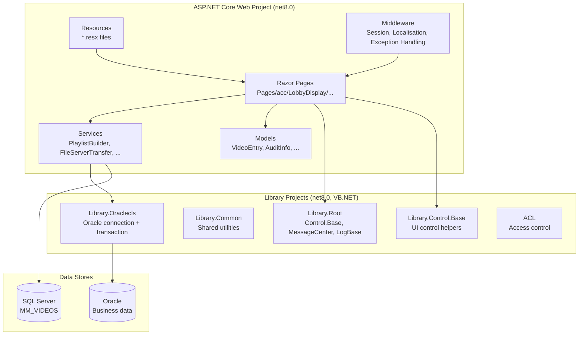

# Design Document: .NET 8 Migration — FLM LobbyDisplay

## Overview

The FLM LobbyDisplay application is an ASP.NET Web Forms system targeting .NET Framework 4.8 (originally 3.5). It drives physical lobby and pantry display screens by rendering video playlists, scrolling text, and multi-screen layouts. The application depends on five internal VB.NET class library DLLs (Library.Root, Library.Common, Library.Control.Base, Library.Oraclecls, ACL) and uses both SQL Server (for display content) and Oracle (for business data).

Because ASP.NET Web Forms is not supported on .NET 8, the migration strategy is a **re-platform**: the UI layer is converted to ASP.NET Core Razor Pages while all business logic, database access patterns, and display behaviour are preserved verbatim. The internal library projects are retargeted to `net8.0` with minimal source changes.

### Migration Scope

| Area | Current | Target |
|---|---|---|
| Web framework | ASP.NET Web Forms (.aspx/.ascx) | ASP.NET Core Razor Pages (.cshtml/.cshtml.cs) |
| Runtime | .NET Framework 4.8 | .NET 8 (net8.0) |
| Library projects | VB.NET targeting .NET 3.5/4.8 | VB.NET targeting net8.0 |
| SQL Server driver | System.Data.SqlClient | Microsoft.Data.SqlClient |
| Oracle driver | Oracle.ManagedDataAccess (full-framework) | Oracle.ManagedDataAccess.Core |
| Configuration | web.config | appsettings.json + IConfiguration |
| Session | System.Web.SessionState | ASP.NET Core distributed session |
| File path resolution | Server.MapPath | IWebHostEnvironment |
| Script injection | ScriptManager.RegisterClientScriptBlock | Inline Razor `<script>` blocks |
| Media controls | Media-Player-ASP.NET-Control.dll + Flash | HTML5 `<video>` element |
| Logging | Silent catch blocks | Microsoft.Extensions.Logging.ILogger |

---

## Architecture

The migrated solution retains the same logical layering as the original but maps each layer to its ASP.NET Core equivalent.



### Key Architectural Decisions

**Razor Pages over MVC Controllers**: The existing pages are self-contained display units with no shared controller logic. Razor Pages (one `.cshtml` + one `PageModel` per page) map directly to the existing `.aspx` + code-behind pattern and minimise structural change.

**Library projects remain VB.NET**: The VB.NET source is available and the .NET 8 SDK fully supports VB.NET class libraries. Rewriting in C# would introduce unnecessary risk. The `Microsoft.VisualBasic.Core` NuGet package covers any VB runtime helpers.

**`System.Configuration.ConfigurationManager` retained via NuGet**: The library projects use `ConfigurationManager` extensively. Rather than refactoring all library code to accept `IConfiguration`, the `System.Configuration.ConfigurationManager` NuGet package (version 8.x) is added to library projects. This keeps library source changes minimal. The web project uses `IConfiguration` natively.

**No UpdatePanel / ScriptManager**: ASP.NET Core has no UpdatePanel. The periodic data refresh (currently `__doPostBack('TimerPanel','')`) is replaced with a lightweight JavaScript `fetch()` call to a dedicated JSON endpoint (`/api/playlist/{screenId}`) that returns updated playlist data. This is simpler and more reliable than partial-page postbacks.

**Static files served from `wwwroot`**: The `css/`, `mainscr/`, `secscrtop/`, and `secscrbtm/` subdirectories under each display area are copied into `wwwroot` under the same relative paths so all existing URL references in HTML/JavaScript remain valid.

---

## Components and Interfaces

### 1. Library Projects

Each library project receives a new SDK-style `.vbproj` file targeting `net8.0`. Source files are unchanged except for the specific substitutions listed below.

#### Library.Oraclecls (Oracle connection layer)

The `Connection.vb` abstract class is the only file requiring a package change. The `Oracle.DataAccess` reference is replaced with `Oracle.ManagedDataAccess.Core`.

```xml
<!-- Library.Oracle.vbproj (SDK-style) -->
<Project Sdk="Microsoft.NET.Sdk">
  <PropertyGroup>
    <TargetFramework>net8.0</TargetFramework>
    <RootNamespace>Library.Oraclecls</RootNamespace>
    <AssemblyName>Library.Oraclecls</AssemblyName>
  </PropertyGroup>
  <ItemGroup>
    <PackageReference Include="Oracle.ManagedDataAccess.Core" Version="23.6.0" />
    <PackageReference Include="System.Configuration.ConfigurationManager" Version="8.0.0" />
    <PackageReference Include="Microsoft.VisualBasic.Core" Version="10.0.0" />
  </ItemGroup>
</Project>
```

The `Connection` class public API is preserved exactly:

```vb
Public MustInherit Class Connection
    Implements IDisposable
    Public Sub New(ByVal ConnectionStringName As String)  ' opens connection, begins transaction
    Public Sub Commit()
    Public Sub RollBack()
    Public Sub Dispose() Implements IDisposable.Dispose
    Public ReadOnly Property Status() As String
End Class
```

#### Library.Root

`System.Web` references in `Control/Base.vb` and `Control/LogBase.vb` are the primary concern. The `Base` class inherits `System.Web.UI.Page` — this inheritance is **removed** and replaced with an abstract base that exposes only the non-UI properties (Key, Action, SortField, etc.) as a plain class. The UI-specific members (`Response.Redirect`, `ResolveUrl`, `Server.UrlDecode`) are extracted into an `IPageContext` interface injected at the web project level.

```vb
' Library.Root — Control/Base.vb (net8.0 version)
Public MustInherit Class Base
    ' No longer inherits System.Web.UI.Page
    Public Enum EnumAction
        None = 0 : Add = 1 : Edit = 3 : Delete = 5 : View = 7 : History = 9
    End Enum
    Public MustOverride Sub BindData()
    Public ReadOnly Property Key() As String
    Public ReadOnly Property Action() As EnumAction
    Public ReadOnly Property SortField() As String
    ' ... all non-UI properties preserved
End Class
```

`MessageCenter.ShowAJAXMessageBox` is updated to write a `<script>alert(...);</script>` block via `IHtmlHelper` or returned as a string for inline Razor injection, removing the `ScriptManager` dependency.

#### Library.Common, Library.Control.Base, ACL

These projects are retargeted to `net8.0` with SDK-style project files. Any `System.Web` references are replaced with `Microsoft.AspNetCore.Http` abstractions or removed if unused. `System.Configuration.ConfigurationManager` is retained via NuGet.

### 2. ASP.NET Core Web Project

#### Project Structure

```
FLM_LobbyDisplay.Web/
├── Program.cs
├── appsettings.json
├── appsettings.Production.json
├── Pages/
│   └── acc/
│       ├── LobbyDisplay/
│       │   ├── Display_Mst.cshtml / .cshtml.cs
│       │   ├── lobby_mainDisplay.cshtml / .cshtml.cs
│       │   └── lobby_2ndDisplay.cshtml / .cshtml.cs
│       ├── LobbyDisplay2/  (same pattern)
│       ├── MstMain/
│       ├── PantryDisplay/
│       └── PopUp/
├── Services/
│   ├── PlaylistBuilderService.cs
│   ├── FileServerTransferService.cs
│   └── ScrollingTextService.cs
├── Models/
│   ├── VideoEntry.cs
│   └── PlaylistData.cs
├── Resources/
│   ├── ACL.resx
│   ├── DetailPage.resx
│   ├── ListPage.resx
│   ├── Message.resx
│   └── ... (all App_GlobalResources files)
├── Api/
│   └── PlaylistController.cs   (minimal API endpoint for AJAX refresh)
└── wwwroot/
    ├── js/
    ├── acc/
    │   ├── LobbyDisplay/
    │   │   ├── css/
    │   │   └── mainscr/
    │   └── ...
    └── ...
```

#### Program.cs Configuration

```csharp
var builder = WebApplication.CreateBuilder(args);

builder.Services.AddRazorPages();
builder.Services.AddControllers(); // for PlaylistController

// Session
builder.Services.AddDistributedMemoryCache();
builder.Services.AddSession(options =>
{
    options.IdleTimeout = TimeSpan.FromMinutes(20); // >= web.config timeout
    options.Cookie.HttpOnly = true;
    options.Cookie.IsEssential = true;
});

// Localisation
builder.Services.AddLocalization(options => options.ResourcesPath = "Resources");
builder.Services.Configure<RequestLocalizationOptions>(options =>
{
    var supported = new[] { new CultureInfo("en-US"), new CultureInfo("ms-MY") };
    options.DefaultRequestCulture = new RequestCulture("en-US");
    options.SupportedCultures = supported;
    options.SupportedUICultures = supported;
    options.RequestCultureProviders.Insert(0, new CookieRequestCultureProvider
    {
        CookieName = "MalaysiaTorayNaviLanguage"
    });
});

// Application services
builder.Services.AddScoped<PlaylistBuilderService>();
builder.Services.AddScoped<ScrollingTextService>();
builder.Services.AddSingleton<FileServerTransferService>();
builder.Services.AddHttpContextAccessor();
builder.Services.AddLogging();

var app = builder.Build();

app.UseExceptionHandler("/Error");
app.UseStaticFiles();
app.UseRouting();
app.UseRequestLocalization();
app.UseSession();
app.MapRazorPages();
app.MapControllers();

app.Run();
```

### 3. Razor Page Conversion Pattern

Each `.aspx` page becomes a Razor Page. The code-behind logic moves to the `PageModel`. The `IsPostBack` pattern is replaced by checking `HttpContext.Request.Method`.

**Original (lobby_mainDisplay.aspx.cs)**:
```csharp
protected void Page_Load(object sender, EventArgs e)
{
    // ... build playlist ...
    if (IsPostBack)
        ScriptManager.RegisterClientScriptBlock(..., "loaded(...);onPageLoad();", true);
    else
        ScriptManager.RegisterClientScriptBlock(..., "loaded2();", true);
}
```

**Migrated (lobby_mainDisplay.cshtml.cs)**:
```csharp
public class LobbyMainDisplayModel : PageModel
{
    private readonly PlaylistBuilderService _playlist;
    private readonly ScrollingTextService _scrolling;
    private readonly ILogger<LobbyMainDisplayModel> _logger;

    public PlaylistData Data { get; private set; }
    public string ScrollingText { get; private set; }
    public bool IsRefresh { get; private set; }  // replaces IsPostBack

    public LobbyMainDisplayModel(PlaylistBuilderService playlist,
        ScrollingTextService scrolling, ILogger<LobbyMainDisplayModel> logger)
    { ... }

    public async Task OnGetAsync()
    {
        IsRefresh = Request.Query.ContainsKey("refresh");
        Data = await _playlist.BuildAsync(screenId: 1);
        ScrollingText = await _scrolling.ReadAsync("MstMain");
        HttpContext.Session.SetString("Checkpoint", "1");
    }
}
```

**Migrated (lobby_mainDisplay.cshtml)**:
```html
@page "/acc/LobbyDisplay/lobby_mainDisplay"
@model LobbyMainDisplayModel
<!-- ... HTML preserved ... -->
<script>
    var video_list    = @Html.Raw(Model.Data.VideoLists);
    var seek_starts   = @Html.Raw(Model.Data.SeekStarts);
    @if (Model.IsRefresh) {
        <text>loaded("@Model.Data.VideoListsCsv", ...); onPageLoad();</text>
    } else {
        <text>loaded2();</text>
    }
</script>
```

The periodic refresh replaces `__doPostBack` with a `fetch` call:
```javascript
function refreshdata() {
    fetch('/api/playlist/1')
        .then(r => r.json())
        .then(data => { loaded(data.videoLists, ...); onPageLoad(); });
}
```

### 4. PlaylistBuilderService

Encapsulates the SQL query and array-building logic extracted from all display page code-behinds.

```csharp
public class PlaylistBuilderService
{
    private readonly IConfiguration _config;
    private readonly ILogger<PlaylistBuilderService> _logger;

    public async Task<PlaylistData> BuildAsync(int screenId)
    {
        var sql = $"SELECT * FROM MM_VIDEOS WHERE RECORD_TYP<>5 AND SCR_ID={screenId}";
        using var con = new SqlConnection(_config.GetConnectionString("filmDisplay"));
        // ... fill DataTable, build arrays ...
    }
}
```

### 5. FileServerTransferService

The `FileServerTransfer` class is migrated to a service. `HttpPostedFile` is replaced with `IFormFile`. `ConfigurationManager.AppSettings` reads are replaced with `IConfiguration`.

```csharp
public class FileServerTransferService
{
    private readonly IConfiguration _config;
    private readonly IWebHostEnvironment _env;

    public async Task<bool> SaveAsync(IFormFile file, string destDirectory, string destFileName)
    {
        // Directory.CreateDirectory, File.Delete, file.CopyToAsync preserved
    }

    public async Task<string> TransferFileAsync(string filename, byte[] content)
    {
        // FluentFTP replaces FtpWebRequest
        using var ftp = new AsyncFtpClient(host, user, pass);
        await ftp.UploadBytes(content, $"{folder}/{filename}");
    }
}
```

### 6. ScrollingTextService

```csharp
public class ScrollingTextService
{
    private readonly IWebHostEnvironment _env;

    public async Task<string> ReadAsync(string area)
    {
        var path = Path.Combine(_env.ContentRootPath, "acc", area, "scrollingtext.txt");
        return File.Exists(path) ? await File.ReadAllTextAsync(path) : string.Empty;
    }
}
```

### 7. Playlist JSON API Endpoint

```csharp
[ApiController]
[Route("api/playlist")]
public class PlaylistController : ControllerBase
{
    private readonly PlaylistBuilderService _playlist;

    [HttpGet("{screenId:int}")]
    public async Task<IActionResult> Get(int screenId)
    {
        var data = await _playlist.BuildAsync(screenId);
        return Ok(data);
    }
}
```

### 8. User Controls → Partial Views

Each `.ascx` in `App_Module` becomes a Razor partial view:

| Original | Migrated |
|---|---|
| `App_Module/Controller.ascx` | `Pages/Shared/_Controller.cshtml` |
| `App_Module/Error.ascx` | `Pages/Shared/_Error.cshtml` |
| `App_Module/GridFooter.ascx` | `Pages/Shared/_GridFooter.cshtml` |
| `App_Module/GridHeader.ascx` | `Pages/Shared/_GridHeader.cshtml` |
| `App_Module/Search.ascx` | `Pages/Shared/_Search.cshtml` |
| `App_Module/Title.ascx` | `Pages/Shared/_Title.cshtml` |

The `Controller.ascx` event model (`AddAction`, `EditAction`, etc.) is replaced with Razor Page handler methods (`OnPostAdd`, `OnPostEdit`, etc.) and the partial view renders buttons that POST to named handlers.

---

## Data Models

### VideoEntry

```csharp
public record VideoEntry(
    string AttachFile,
    string SeekStart,
    string SeekEnd,
    string PeriodStart,
    string PeriodEnd
);
```

### PlaylistData

```csharp
public class PlaylistData
{
    public string VideoLists { get; init; }    // JavaScript array literal: ['path/a.mp4','path/b.mp4']
    public string SeekStarts { get; init; }
    public string SeekEnds { get; init; }
    public string PeriodStarts { get; init; }
    public string PeriodEnds { get; init; }

    // CSV variants for the loaded() JS call (brackets and trailing comma stripped)
    public string VideoListsCsv { get; init; }
    public string SeekStartsCsv { get; init; }
    public string SeekEndsCsv { get; init; }
    public string PeriodStartsCsv { get; init; }
    public string PeriodEndsCsv { get; init; }

    public static PlaylistData Empty => new() { VideoLists = "[]", ... };
}
```

### Configuration (appsettings.json)

```json
{
  "ConnectionStrings": {
    "filmDisplay": "Server=...;Database=...;User Id=...;Password=${FILM_DB_PASSWORD}",
    "ORCL_ACL": "Data Source=...;User Id=...;Password=${ORACLE_ACL_PASSWORD}"
  },
  "AppSettings": {
    "FILESERVER_KEY": "/files",
    "FILESERVER_PATH": "\\\\fileserver\\share",
    "FILESERVER_URL": "http://fileserver/files",
    "FLASHINSTALLER_FILE": "",
    "FLASHINSTALLER_IMAGE": ""
  },
  "Logging": {
    "LogLevel": { "Default": "Information", "Microsoft.AspNetCore": "Warning" }
  }
}
```

Sensitive values (passwords) are stored as environment variables or via .NET Secret Manager and referenced with `${VAR_NAME}` placeholders in `appsettings.Production.json`.

---

## Correctness Properties

*A property is a characteristic or behavior that should hold true across all valid executions of a system — essentially, a formal statement about what the system should do. Properties serve as the bridge between human-readable specifications and machine-verifiable correctness guarantees.*

The following properties are suitable for property-based testing because they involve pure transformation functions (playlist building, script injection, message encoding, resource lookup) where input variation meaningfully exercises edge cases. Infrastructure concerns (build configuration, package references, IIS deployment) are verified by smoke and integration tests instead.

The recommended PBT library for C# is **FsCheck** (via `FsCheck.Xunit`) or **CsCheck**. For VB.NET library tests, FsCheck integrates cleanly.

---

### Property 1: Playlist builder produces valid JavaScript array literals for any non-empty video row set

*For any* non-empty collection of `VideoEntry` records, `PlaylistBuilderService.Build` SHALL produce `VideoLists`, `SeekStarts`, `SeekEnds`, `PeriodStarts`, and `PeriodEnds` strings that are valid JavaScript array literals (start with `[`, end with `]`, contain one quoted entry per row).

**Validates: Requirements 9.1, 9.2, 9.3**

---

### Property 2: Playlist builder produces empty arrays for zero-row input

*For any* empty `DataTable` (zero rows), `PlaylistBuilderService.Build` SHALL return a `PlaylistData.Empty` value where all array strings are `[]` and no exception is thrown.

**Validates: Requirements 4.4, 9.1**

---

### Property 3: Postback script injection round-trip

*For any* `PlaylistData` value, the postback script string produced by the page model SHALL contain a `loaded(...)` call whose comma-separated arguments, when re-parsed by splitting on `","`, reconstruct the original CSV values exactly.

**Validates: Requirements 9.4**

---

### Property 4: Resource key-value preservation

*For any* resource key present in the original `.resx` files, the migrated `IStringLocalizer` lookup for that key SHALL return the same string value as the original `GetGlobalResourceObject` call.

**Validates: Requirements 3.3**

---

### Property 5: Culture selection from cookie

*For any* culture string value stored in the `MalaysiaTorayNaviLanguage` cookie that is a supported culture (`en-US` or `ms-MY`), the ASP.NET Core localisation middleware SHALL set `Thread.CurrentThread.CurrentCulture` to a `CultureInfo` whose `Name` equals that cookie value.

**Validates: Requirements 3.4, 6.2**

---

### Property 6: Session round-trip

*For any* string value written to a session key, reading that same key from the ASP.NET Core session SHALL return the identical string value.

**Validates: Requirements 6.1, 6.4**

---

### Property 7: Flash markup replacement produces no SWF references

*For any* HTML string containing Flash plugin markup (`.swf` references, `<param name="flashvars">`), the migrated `ConvertToHtml5` function SHALL return a string that contains no `.swf` references and contains at least one `<video` or `<audio` element.

**Validates: Requirements 8.2**

---

### Property 8: MessageCenter alert encoding preserves message content

*For any* message string (including strings with single quotes, HTML special characters, and newlines), `MessageCenter.ShowAJAXMessageBox` SHALL produce an HTML string that contains `alert(` and whose decoded alert argument, when unescaped, is semantically equivalent to the original message.

**Validates: Requirements 12.2**

---

### Property 9: Connection failure log contains name but not password

*For any* connection failure exception and connection string name, the error log entry produced by the SQL/Oracle error handler SHALL contain the connection string name and the exception message, and SHALL NOT contain the password value from the connection string.

**Validates: Requirements 12.4**

---

## Error Handling

### Exception Handling Middleware

`Program.cs` configures `app.UseExceptionHandler("/Error")`. A dedicated `Error.cshtml` Razor Page renders a user-friendly message. In development, `app.UseDeveloperExceptionPage()` is used instead.

### Database Error Handling

All `catch (Exception)` blocks that previously swallowed exceptions silently are replaced with:

```csharp
catch (Exception ex)
{
    _logger.LogError(ex, "SQL query failed on connection {ConnectionName}: {Message}",
        connectionName, ex.Message);
    // Do not log the connection string itself — only the name
}
```

For Oracle:
```csharp
catch (OracleException ex)
{
    _logger.LogError(ex, "Oracle connection failed on {ConnectionName}: {Message}",
        connectionStringName, ex.Message);
    throw; // re-throw so callers can handle
}
```

### MessageCenter Migration

`MessageCenter.ShowAJAXMessageBox` is updated to return a script string rather than calling `ScriptManager`. Razor Pages inject it inline:

```csharp
// Library.Root — MessageCenter.vb (net8.0)
Public Shared Function BuildAlertScript(ajax_msg As String) As String
    Dim encoded = HttpUtility.HtmlEncode(ajax_msg.Replace("'", """"))
    Return $"<script>alert('{encoded.Replace("||", "\n")}');</script>"
End Function
```

```html
<!-- In Razor Page -->
@if (Model.AlertMessage != null)
{
    @Html.Raw(MessageCenter.BuildAlertScript(Model.AlertMessage))
}
```

### File Operation Error Handling

`FileServerTransferService` wraps all I/O operations in try/catch blocks that log via `ILogger` and return `false` (matching the original boolean return contract) rather than swallowing silently.

---

## Testing Strategy

### Dual Testing Approach

Unit tests cover specific examples and edge cases. Property-based tests (FsCheck) verify universal properties across generated inputs. Both are required for comprehensive coverage.

### Unit Tests

- `PlaylistBuilderServiceTests`: Verify correct array format for known video row sets; verify empty result for zero rows.
- `ScrollingTextServiceTests`: Verify correct path resolution using `IWebHostEnvironment` mock.
- `FileServerTransferServiceTests`: Verify directory creation, file overwrite, archive behaviour with mock file system.
- `CultureMiddlewareTests`: Verify `en-US` and `ms-MY` cookie values set correct culture.
- `MessageCenterTests`: Verify alert script output for known inputs including special characters.
- `Display_MstPageTests`: Verify `navigate()` equivalent opens correct URLs.

### Property-Based Tests (FsCheck)

Each property test runs a minimum of **100 iterations**. Tests are tagged with the feature and property number.

```csharp
// Tag format: Feature: dotnet8-migration, Property N: <property text>

[Property]
// Feature: dotnet8-migration, Property 1: Playlist builder produces valid JS array literals
public Property PlaylistBuilder_ValidArrayLiterals(NonEmptyArray<VideoEntry> entries)
{
    var data = PlaylistBuilderService.Build(entries.Get);
    return (data.VideoLists.StartsWith("[") && data.VideoLists.EndsWith("]")
         && data.SeekStarts.StartsWith("[") && data.SeekStarts.EndsWith("]")).ToProperty();
}

[Property]
// Feature: dotnet8-migration, Property 3: Postback script injection round-trip
public Property PostbackScript_RoundTrip(PlaylistData data)
{
    var script = PageModelHelper.BuildPostbackScript(data);
    var extracted = ExtractLoadedArgs(script);
    return (extracted.VideoListsCsv == data.VideoListsCsv).ToProperty();
}

[Property]
// Feature: dotnet8-migration, Property 4: Resource key-value preservation
public Property ResourceLookup_PreservesValues(ResourceKey key)
{
    var original = OriginalResourceHelper.Get(key.ClassName, key.Key);
    var migrated = MigratedLocalizer[key.Key].Value;
    return (original == migrated).ToProperty();
}

[Property]
// Feature: dotnet8-migration, Property 6: Session round-trip
public Property Session_RoundTrip(NonEmptyString key, NonEmptyString value)
{
    var session = new TestSession();
    session.SetString(key.Get, value.Get);
    return (session.GetString(key.Get) == value.Get).ToProperty();
}

[Property]
// Feature: dotnet8-migration, Property 7: Flash markup replacement produces no SWF references
public Property FlashReplacement_NoSwfReferences(FlashMarkupString input)
{
    var result = Html5MediaConverter.Convert(input.Value);
    return (!result.Contains(".swf") && 
            (result.Contains("<video") || result.Contains("<audio"))).ToProperty();
}

[Property]
// Feature: dotnet8-migration, Property 8: MessageCenter alert encoding
public Property MessageCenter_AlertEncoding(NonEmptyString message)
{
    var script = MessageCenter.BuildAlertScript(message.Get);
    return (script.Contains("alert(") && 
            !script.Contains(message.Get.Replace("'", "\""))).ToProperty();
    // encoded form is present, raw single-quoted form is not
}

[Property]
// Feature: dotnet8-migration, Property 9: Connection failure log omits password
public Property ConnectionError_LogOmitsPassword(ConnectionStringPair cs, Exception ex)
{
    var logEntry = ErrorHandler.BuildLogEntry(cs.Name, cs.Password, ex);
    return (logEntry.Contains(cs.Name) && 
            logEntry.Contains(ex.Message) && 
            !logEntry.Contains(cs.Password)).ToProperty();
}
```

### Integration Tests

- URL routing: verify each known page URL returns HTTP 200.
- Static file serving: verify CSS and media files are accessible at original relative paths.
- IIS deployment: verify application starts and health endpoint responds after `dotnet publish`.
- FTP upload: verify file upload completes against a mock FTP server (MockFtpServer or similar).

### Smoke Tests

Run as part of CI after `dotnet build`:
- All library `.vbproj` files target `net8.0`.
- No `System.Web` references remain in library projects.
- `Oracle.ManagedDataAccess.Core` is referenced in Library.Oracle.
- `filmDisplay` and `ORCL_ACL` connection strings exist in `appsettings.json`.
- No `ScriptManager.RegisterClientScriptBlock` calls remain in web project.
- No `Server.MapPath` calls remain in web project.
- No empty `catch` blocks remain (enforced by Roslyn analyser rule CA1031 set to error).
