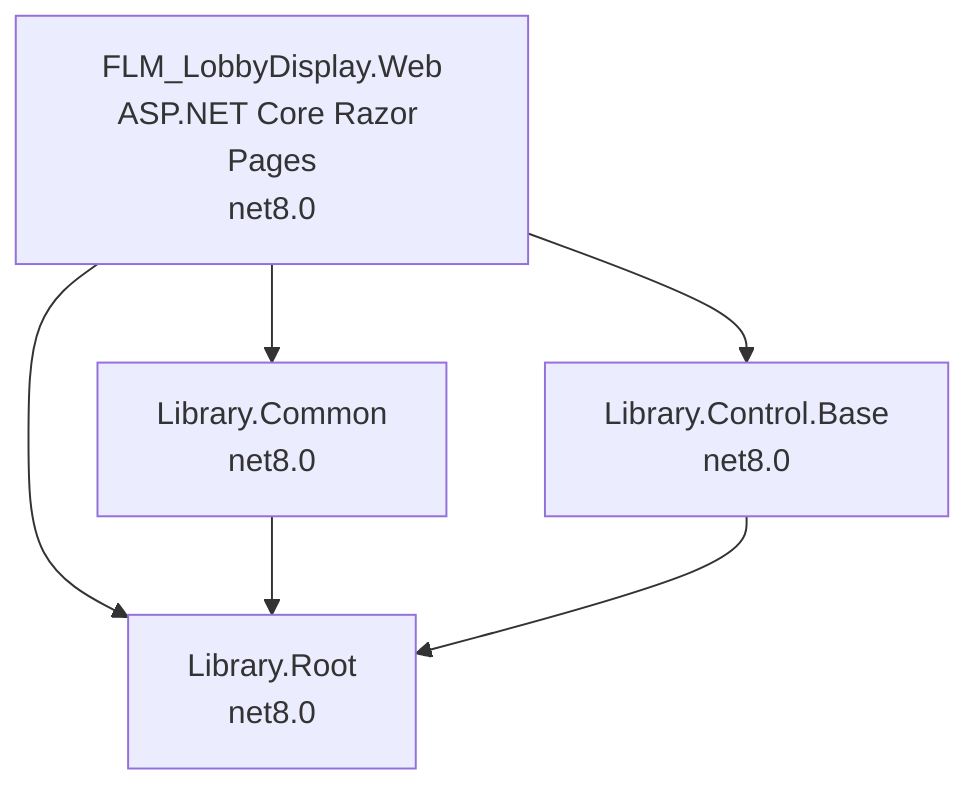

# Design Document: Library .csproj .NET 8 Migration

## Overview

This design covers migrating three C# library projects — Library.Root, Library.Common, and Library.Control.Base — from .NET Framework 4.5 old-style MSBuild format to .NET 8.0 SDK-style format. The VB.NET versions of these libraries have already been migrated and serve as the authoritative reference for every change.

The migration involves three categories of work:

1. **Project file conversion** — Replace old-style .csproj XML with minimal SDK-style format targeting net8.0.
2. **System.Web dependency removal** — Rewrite C# source files to eliminate all System.Web references, following the patterns already established in the VB.NET files.
3. **Project reference update** — Switch the web project (FLM_LobbyDisplay.Web) from .vbproj references to .csproj references.

The VB.NET files are the single source of truth for migration decisions. Every C# change mirrors a VB.NET change that already compiles and runs.

## Architecture

The solution has a layered dependency structure:



**Build order**: Library.Root → Library.Common + Library.Control.Base → FLM_LobbyDisplay.Web

After migration, the web project references switch from `.vbproj` to `.csproj`:

| Current Reference | Migrated Reference |
|---|---|
| `Library.Root.vbproj` | `Library.Root.csproj` |
| `Library.Common.vbproj` | `Library.Common.csproj` |
| `Library.Control.Base.vbproj` | `Library.Control.Base.csproj` |

## Components and Interfaces

### 1. Project Files (.csproj)

Each of the three old-style .csproj files is replaced with a minimal SDK-style file. The VB.NET .vbproj files are the template.

**Library.Root.csproj** (mirrors Library.Root.vbproj):
```xml
<Project Sdk="Microsoft.NET.Sdk">
  <PropertyGroup>
    <TargetFramework>net8.0</TargetFramework>
    <RootNamespace>Library.Root</RootNamespace>
    <AssemblyName>Library.Root</AssemblyName>
    <Nullable>disable</Nullable>
  </PropertyGroup>
  <ItemGroup>
    <PackageReference Include="System.Configuration.ConfigurationManager" Version="8.0.0" />
  </ItemGroup>
</Project>
```

**Library.Common.csproj** (mirrors Library.Common.vbproj, but references .csproj):
```xml
<Project Sdk="Microsoft.NET.Sdk">
  <PropertyGroup>
    <TargetFramework>net8.0</TargetFramework>
    <RootNamespace>Library.common</RootNamespace>
    <AssemblyName>Library.common</AssemblyName>
    <Nullable>disable</Nullable>
  </PropertyGroup>
  <ItemGroup>
    <PackageReference Include="System.Configuration.ConfigurationManager" Version="8.0.0" />
  </ItemGroup>
  <ItemGroup>
    <ProjectReference Include="..\Library.Root\Library.Root.csproj" />
  </ItemGroup>
</Project>
```

**Library.Control.Base.csproj** (mirrors Library.Control.Base.vbproj, but references .csproj):
```xml
<Project Sdk="Microsoft.NET.Sdk">
  <PropertyGroup>
    <TargetFramework>net8.0</TargetFramework>
    <RootNamespace>Library.Control.Base</RootNamespace>
    <AssemblyName>Library.Control.Base</AssemblyName>
    <Nullable>disable</Nullable>
  </PropertyGroup>
  <ItemGroup>
    <PackageReference Include="System.Configuration.ConfigurationManager" Version="8.0.0" />
  </ItemGroup>
</Project>
```

**Key differences from VB.NET .vbproj files**:
- No `<OptionStrict>Off</OptionStrict>` (C#-only omission)
- Library.Common and Library.Control.Base reference `.csproj` instead of `.vbproj`

### 2. IPageContext Interface (new C# file)

A new file `Library/Library.Root/Control/IPageContext.cs` mirrors `IPageContext.vb`:

```csharp
namespace Library.Root.Control
{
    public interface IPageContext
    {
        void Redirect(string url);
        string ResolveUrl(string relativeUrl);
        string UrlDecode(string value);
        string UrlEncode(string value);
    }
}
```

### 3. Control.Base Class (Library.Root/Control/Base.cs)

**Current**: Inherits `System.Web.UI.Page`, uses `OnInit`/`OnLoad` lifecycle, `Request.QueryString`, `ViewState`, `Response.Redirect`, `ResolveUrl`, `Server.UrlEncode`/`UrlDecode`, GridView column setup, sorting/row event handlers.

**Migrated** (following Base.vb pattern):
- Remove `System.Web.UI.Page` inheritance → plain `abstract class`
- Constructor accepts `IPageContext`, `NameValueCollection`, `bool isPostBack`
- Constructor calls `BindAction`, `BindSort`, `CheckURL`, `BindKey` in the same order as original `OnInit`/`OnLoad`
- `Response.Redirect` → `_pageContext.Redirect`
- `ResolveUrl` → `_pageContext.ResolveUrl`
- `Server.UrlEncode`/`Server.UrlDecode` → `Uri.EscapeDataString`/`Uri.UnescapeDataString`
- `Request.QueryString` → injected `NameValueCollection`
- `ViewState` → `Dictionary<string, object>`
- Remove all GridView-related properties, event handlers, and Web Forms UI logic (GridView property, OnLoad column setup, Sorting handler, RowCreated handler, RowDataBound handler, RecordTypeColumn, DeleteClassName, DeleteConfirmationBox, DeletedVisibleControl, DeletedText, ShowDeletedControl, ViewHistoryControl, PrintControl, GridViewRowMouseOver, GridViewRowMouseOut, GridViewCheckColumn, GridViewRadioColumn, DeleteImagePath, AdvancedControl, AddControl, grdResult_Sorting, grdResult_DoSorting)
- Remove `using System.Web.UI.WebControls`

### 4. LogBase Class (Library.Root/Control/LogBase.cs)

**Current**: Inherits `System.Web.UI.Page`, uses `OnInit`/`OnLoad`, `Request.QueryString`, `Server.UrlDecode`/`UrlEncode`, `ResolveUrl`.

**Migrated** (following LogBase.vb pattern):
- Remove `System.Web.UI.Page` inheritance → plain `abstract class`
- Constructor accepts `NameValueCollection`
- Constructor calls `BindKey()` then `BindData()`
- `Server.UrlDecode` → `Uri.UnescapeDataString`
- `Server.UrlEncode` → `Uri.EscapeDataString`
- `Request.QueryString` → injected `NameValueCollection`
- `GenerateList` uses direct string concatenation (no `ResolveUrl`), matching VB pattern
- Remove `OnInit`/`OnLoad` overrides

### 5. Convertion Class (Library.Root/Control/Convertion.cs)

**Current**: Uses `System.Web.Script.Serialization.JavaScriptSerializer`.

**Migrated** (following Convertion.vb pattern):
- Replace `JavaScriptSerializer` with `System.Text.Json.JsonSerializer`
- Remove `_ser` static field
- `Serializer` → `JsonSerializer.Serialize(list)`
- `Deserializer` → `JsonSerializer.Deserialize<List<T>>(StringFormat)`
- Remove `using System.Web.Script.Serialization`

### 6. MessageCenter Class (Library.Root/Control/MessageCenter.cs)

**Current**: Two static methods taking `System.Web.UI.Page`, using `ScriptManager`, `HttpContext.Current.Server.HtmlEncode`, `ClientScript`.

**Migrated** (following MessageCenter.vb pattern):
- Replace both methods with single `BuildAlertScript(string ajax_msg)` returning a script string
- Use `System.Net.WebUtility.HtmlEncode` for encoding (available in net8.0 without extra packages)
- Remove all references to `System.Web.UI.Page`, `ScriptManager`, `HttpContext`, `ClientScript`

### 7. Object.Base Class (Library.Root/Object/Base.cs)

**Current**: Constructor reads from `HttpContext.Current.Session` and `HttpContext.Current.Request`.

**Migrated** (following Base.vb pattern):
- Initialize `CreatedBy`, `CreatedLoc`, `UpdatedBy`, `UpdatedLoc` to `string.Empty`
- Remove `using System.Web`

### 8. TemplateField Classes (Library.Root/TemplateField/*.cs)

**Current**: Five classes implementing `System.Web.UI.ITemplate` with `InstantiateIn` methods creating Web Forms controls.

**Migrated** (following *.vb stubs):
- Each class becomes a minimal stub with only a constructor accepting `int type`
- Remove `ITemplate` implementation, `InstantiateIn`, all Web Forms control creation
- Remove `using System.Web.UI` and `using System.Web.UI.WebControls`

### 9. LocalLabel Class (Library.Root/Component/LocalLabel.cs + LocalLabel.Designer.cs)

**Current**: Inherits `WebControl`, uses `ViewState`, `HtmlTextWriter`, `ResourceManager` with `App_GlobalResources`.

**Migrated** (following LocalLabel.vb stub):
- Remove `WebControl` inheritance → plain class
- Retain `Key` property (auto-property) and `Text` property returning `string.Empty`
- Remove `RenderBeginTag`, `RenderContents`, `OnInit`, `ResourceManager`, `ViewState`
- Empty or remove `LocalLabel.Designer.cs`

### 10. Library.Control.Base.Page (Library.Control.Base/Page.cs)

**Current**: Inherits `System.Web.UI.Page`, has `PlaceHolder ControlPanel`, `Remove(Control)`, `_list` field.

**Migrated** (following Page.vb pattern):
- Remove `System.Web.UI.Page` inheritance → plain `abstract class`
- Remove `ControlPanel` property, `Remove` method, `_list` field
- Retain properties: `Action`, `CurrentStep`, `Worksno`, `CelNo`, `CompCode`, `Reqno`

### 11. Library.Control.Base.UserControl (Library.Control.Base/UserControl.cs)

**Current**: Inherits `System.Web.UI.UserControl`.

**Migrated** (following UserControl.vb pattern):
- Remove `System.Web.UI.UserControl` inheritance → plain `abstract class`
- Retain `EditMode`, `ValidationGroup` properties and all abstract method signatures

### 12. Generator Class (Library.Common/Component/Generator.cs)

**Current**: Uses `System.Web.UI.HtmlTextWriter` and `System.Web.UI.WebControls.DataGrid` to render HTML.

**Migrated** (following Generator.vb pattern):
- Replace `DataGrid`/`HtmlTextWriter` rendering with `StringBuilder`-based manual HTML table construction
- Use `System.Net.WebUtility.HtmlEncode` for encoding cell values (or `System.Web.HttpUtility.HtmlEncode`)
- Remove `using System.Web.UI` and `using System.IO` (StringWriter no longer needed)

### 13. AssemblyInfo Files

Remove `Properties/AssemblyInfo.cs` from all three projects. SDK-style projects auto-generate assembly attributes, and keeping the old files causes duplicate attribute errors.

### 14. Web Project Reference Update

Update `FLM_LobbyDisplay.Web.csproj` to reference `.csproj` instead of `.vbproj`:

```xml
<ProjectReference Include="..\Library\Library.Root\Library.Root.csproj" />
<ProjectReference Include="..\Library\Library.Common\Library.Common.csproj" />
<ProjectReference Include="..\Library\Library.Control.Base\Library.Control.Base.csproj" />
```

## Data Models

No data model changes. The migration preserves all existing class properties and their types. The only structural changes are:

- `Control.Base` constructor signature changes (adds `IPageContext`, `NameValueCollection`, `bool`)
- `LogBase` constructor signature changes (adds `NameValueCollection`)
- `MessageCenter` method signature changes (two methods → one `BuildAlertScript`)
- `Object.Base` constructor no longer reads from `HttpContext`

All property types, names, and public API shapes remain identical to the VB.NET reference implementations.

## Error Handling

Error handling is minimal for this migration since it's a compile-time transformation:

- **Build errors**: The primary error signal. Each project must build with zero errors after migration.
- **Namespace conflicts**: The SDK-style .csproj auto-includes all `.cs` files. Since VB.NET `.vb` files coexist in the same directories, the C# project must NOT accidentally include `.vb` files. SDK-style projects only include files matching the project language by default, so this is handled automatically.
- **Duplicate assembly attributes**: Resolved by removing `Properties/AssemblyInfo.cs` files rather than setting `<GenerateAssemblyInfo>false</GenerateAssemblyInfo>`, keeping the .csproj minimal.
- **Missing `Microsoft.VisualBasic` reference**: The C# `Base.cs` currently uses `Microsoft.VisualBasic.Information.IsNumeric`. The migrated VB.NET code uses the built-in `IsNumeric` function. In C#, replace with `int.TryParse` or add a `Microsoft.VisualBasic` package reference. The VB.NET reference doesn't need this explicitly because VB projects include it automatically. Decision: use `int.TryParse` to avoid the dependency.

## Testing Strategy

**Property-based testing is NOT applicable for this feature.** This is an infrastructure migration task — converting project files, removing framework dependencies, and stubbing out classes. There are no pure functions with meaningful input variation to test. The Convertion class is a thin wrapper around `System.Text.Json.JsonSerializer`, and testing its round-trip would test the framework, not our code.

**Verification approach**:

1. **Build verification** (primary): Run `dotnet build` on each project in dependency order:
   - `dotnet build Library/Library.Root/Library.Root.csproj`
   - `dotnet build Library/Library.Common/Library.Common.csproj`
   - `dotnet build Library/Library.Control.Base/Library.Control.Base.csproj`
   - `dotnet build FLM_LobbyDisplay.Web/FLM_LobbyDisplay.Web.csproj`
   
   All must complete with zero errors.

2. **Manual review**: Compare each migrated C# file against its VB.NET counterpart to confirm the same patterns were applied.

3. **Smoke test**: After build succeeds, verify the web project can start without runtime errors (manual step by developer).
