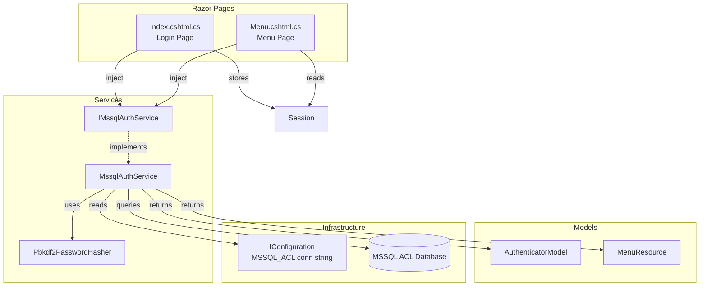

# Design Document: MSSQL Auth Migration

## Overview

This design replaces the Oracle-based authentication subsystem (`OracleAuthService`) with an MSSQL-backed implementation following the FILM_Sparepart_MVC reference architecture. The migration touches four layers: data access (Oracle → MSSQL via `Microsoft.Data.SqlClient`), password security (MD5 → PBKDF2), service registration (DI swap), and page integration (Index + Menu pages).

The new `MssqlAuthService` implements the same public contract as `OracleAuthService` — credential validation, menu resource retrieval, and change-password — but queries MSSQL tables directly instead of calling Oracle stored procedures. An `AuthenticatorModel` carries user identity/role data between the service and consuming pages. A `Pbkdf2PasswordHasher` handles all password hashing and verification using `Rfc2898DeriveBytes` with HMAC-SHA256.

The design preserves the existing login UX, session keys, and menu-building logic. Pages continue to inject a single auth service; only the backing implementation changes.

## Architecture



**Key architectural decisions:**

1. **Interface extraction**: Introduce `IMssqlAuthService` so pages depend on an abstraction. This enables unit testing with mocks and a clean DI swap.
2. **Separate hasher class**: `Pbkdf2PasswordHasher` is a standalone static utility (no state, no DI needed). This keeps hashing logic testable in isolation.
3. **Reuse existing `MenuResource` model**: The `MenuResource` class already has the right shape. We keep it and move it to the Models folder.
4. **Direct SQL queries**: Use parameterized `SqlCommand` queries against MSSQL tables instead of stored procedures, matching the FILM_Sparepart_MVC reference pattern (`ValidateUserInfo` query).

## Components and Interfaces

### IMssqlAuthService (Interface)

```csharp
namespace FLM_LobbyDisplay.Services;

public interface IMssqlAuthService
{
    /// Validates credentials against MSSQL ACL. Returns populated AuthenticatorModel.
    AuthenticatorModel ValidateUser(string loginId, string systemName);

    /// Validates AD username against MSSQL ACL (no password check).
    AuthenticatorModel ValidateAdUser(string adUsername, string systemName);

    /// Returns menu resources for a given role ID and system name.
    List<MenuResource> GetMenuResources(int roleId, string systemName);

    /// Changes password: verifies old, stores new PBKDF2 hash.
    bool ChangePassword(string loginId, string oldPassword, string newPassword);
}
```

### MssqlAuthService (Implementation)

- Constructor: `(IConfiguration config, ILogger<MssqlAuthService> logger)`
- Reads `ConnectionStrings:MSSQL_ACL` from configuration
- Throws `InvalidOperationException` at first use if connection string is missing/empty
- Uses `Microsoft.Data.SqlClient.SqlConnection` and `SqlCommand` with parameterized queries
- `ValidateUser`: queries user table by loginId + systemName, verifies password hash via `Pbkdf2PasswordHasher`, populates `AuthenticatorModel`
- `ValidateAdUser`: queries user table by AD username + systemName (no password verification), populates `AuthenticatorModel`
- `GetMenuResources`: queries resource/role tables by roleId + systemName, returns `List<MenuResource>`
- `ChangePassword`: verifies old password hash, generates new hash, updates database

### Pbkdf2PasswordHasher (Static Utility)

```csharp
namespace FLM_LobbyDisplay.Services;

public static class Pbkdf2PasswordHasher
{
    // Format: [0x00 header (1 byte)] [salt (16 bytes)] [derived key (32 bytes)] = 49 bytes
    // Stored as Base64 string

    public static string HashPassword(string password);
    public static bool VerifyHashedPassword(string hashedPassword, string providedPassword);
}
```

- `HashPassword`: generates 16-byte random salt via `RandomNumberGenerator`, derives 32-byte key using `Rfc2898DeriveBytes` (1000 iterations, HMAC-SHA256), returns Base64 of 49-byte array
- `VerifyHashedPassword`: decodes Base64, extracts salt from bytes[1..16], recomputes derived key with same parameters, compares bytes[17..48] using fixed-time comparison

### AuthenticatorModel

```csharp
namespace FLM_LobbyDisplay.Models;

public class AuthenticatorModel
{
    public int    ID_ACL_USER     { get; set; }
    public int    ID_ACL_ROLE     { get; set; }
    public int    ID_ACL_RESOURCE { get; set; }
    public string USER_ID         { get; set; } = string.Empty;
    public string USR_EMAIL       { get; set; } = string.Empty;
    public string COMPANY         { get; set; } = string.Empty;
    public string EMP_NO          { get; set; } = string.Empty;
    public string EMP_NAME        { get; set; } = string.Empty;
    public string ROLE_NAME       { get; set; } = string.Empty;
    public string ROLE_DESC       { get; set; } = string.Empty;
    public string RESOURCE_NAME   { get; set; } = string.Empty;
    public string RESOURCE_DESC   { get; set; } = string.Empty;
    public bool   VALID_USER      { get; set; }
    public string LOGIN_ID        { get; set; } = string.Empty;
    public string PASSWORD        { get; set; } = string.Empty;
}
```

### MenuResource (Existing — relocated)

Moved from `OracleAuthService.cs` to `FLM_LobbyDisplay.Web/Models/MenuResource.cs`. Same shape:

```csharp
namespace FLM_LobbyDisplay.Models;

public class MenuResource
{
    public int    ResourceID   { get; set; }
    public string ResourceName { get; set; } = string.Empty;
    public string ResourceURL  { get; set; } = string.Empty;
    public string ResourceDesc { get; set; } = string.Empty;
    public int    ParentID     { get; set; }
    public int    AppID        { get; set; }
}
```

### AD Username Resolver

Implemented as a helper method within `MssqlAuthService` or as inline logic in `Index.cshtml.cs`:

```csharp
// Extract username from "DOMAIN\username" format
static string ExtractAdUsername(string identityName)
{
    if (string.IsNullOrEmpty(identityName)) return string.Empty;
    var parts = identityName.Split('\\');
    return parts.Length > 1 ? parts[1] : parts[0];
}
```

## Data Models

### MSSQL ACL Database Schema (Expected)

Based on the FILM_Sparepart_MVC reference, the MSSQL ACL database contains these key tables:


**ACL_USER table** — stores user credentials and profile:
| Column | Type | Description |
|--------|------|-------------|
| ID_ACL_USER | int (PK) | User primary key |
| LOGIN_ID | nvarchar | Login identifier |
| PASSWORD | nvarchar | PBKDF2 hashed password (Base64, 49 bytes decoded) |
| USER_ID | nvarchar | Display user ID |
| USR_EMAIL | nvarchar | Email address |
| COMPANY | nvarchar | Company code |
| EMP_NO | nvarchar | Employee number |
| EMP_NAME | nvarchar | Employee display name |
| USER_AD | nvarchar | Windows AD username (nullable) |

**ACL_USER_ROLE table** — maps users to roles per system:
| Column | Type | Description |
|--------|------|-------------|
| ID_ACL_USER | int (FK) | User foreign key |
| ID_ACL_ROLE | int (FK) | Role foreign key |
| SYSTEM_NAME | nvarchar | Application identifier |

**ACL_ROLE table** — role definitions:
| Column | Type | Description |
|--------|------|-------------|
| ID_ACL_ROLE | int (PK) | Role primary key |
| ROLE_NAME | nvarchar | Role name |
| ROLE_DESC | nvarchar | Role description |

**ACL_RESOURCE table** — menu/page resources:
| Column | Type | Description |
|--------|------|-------------|
| ID_AC_RESOURCE | int (PK) | Resource primary key |
| RESOURCE_NAME | nvarchar | Resource name |
| RESOURCE_URL | nvarchar | Page URL |
| RESOURCE_DESC | nvarchar | Display description |
| RESOURCE_PARENT_ID | int | Parent resource (for hierarchy) |
| RESOURCE_APP_ID | int | Application ID |

**ACL_ROLE_RESOURCE table** — maps roles to permitted resources:
| Column | Type | Description |
|--------|------|-------------|
| ID_ACL_ROLE | int (FK) | Role foreign key |
| ID_AC_RESOURCE | int (FK) | Resource foreign key |

### PBKDF2 Hash Format

```
Byte layout (49 bytes total):
[0]       = 0x00 (version/header byte)
[1..16]   = 16-byte cryptographic random salt
[17..48]  = 32-byte PBKDF2 derived key (HMAC-SHA256, 1000 iterations)

Stored as: Convert.ToBase64String(byte[49]) → ~68 character Base64 string
```

### Session Keys (Unchanged)

| Session Key | Source Field | Description |
|-------------|-------------|-------------|
| `gstrUserID` | AuthenticatorModel.USER_ID | User identifier |
| `gettemp` | AuthenticatorModel.EMP_NAME | Employee display name |
| `gstrUsername` | AuthenticatorModel.LOGIN_ID | Login username |
| `system` | System name from config | System identifier string |
| `roleId` | AuthenticatorModel.ID_ACL_ROLE | Role ID (new — needed for menu queries) |
| `LoginHis` | DateTime.Now formatted | Login timestamp |

### Configuration Changes

**appsettings.json** — replace `ORCL_ACL` with `MSSQL_ACL`:
```json
{
  "ConnectionStrings": {
    "filmDisplay": "...(unchanged)...",
    "MSSQL_ACL": "Data Source=<server>;Initial Catalog=<acl_db>;User Id=<user>;Password=<pwd>;TrustServerCertificate=True"
  }
}
```

## Correctness Properties

*A property is a characteristic or behavior that should hold true across all valid executions of a system — essentially, a formal statement about what the system should do. Properties serve as the bridge between human-readable specifications and machine-verifiable correctness guarantees.*

### Property 1: PBKDF2 hash-then-verify round-trip

*For any* valid plaintext password string, hashing it with `Pbkdf2PasswordHasher.HashPassword` and then verifying the same plaintext against the resulting hash with `Pbkdf2PasswordHasher.VerifyHashedPassword` SHALL return true. Additionally, the raw hash bytes SHALL be exactly 49 bytes: a 0x00 header byte, followed by 16 salt bytes, followed by 32 derived-key bytes.

**Validates: Requirements 2.1, 2.2, 2.4**

### Property 2: PBKDF2 unique salt per hash

*For any* plaintext password, hashing it twice with `Pbkdf2PasswordHasher.HashPassword` SHALL produce two different Base64 hash strings (because each call generates a new random salt).

**Validates: Requirements 2.3**

### Property 3: PBKDF2 rejects wrong passwords

*For any* two distinct plaintext passwords A and B, hashing password A and then verifying password B against that hash SHALL return false.

**Validates: Requirements 2.5**

### Property 4: AuthenticatorModel field mapping preserves all fields

*For any* set of 14 field values (ID_ACL_USER, ID_ACL_ROLE, USER_ID, USR_EMAIL, COMPANY, EMP_NO, EMP_NAME, ROLE_NAME, ROLE_DESC, RESOURCE_NAME, RESOURCE_DESC, VALID_USER, LOGIN_ID, PASSWORD), mapping them through the DataReader-to-AuthenticatorModel conversion SHALL produce a model where every field matches the original input value.

**Validates: Requirements 1.2**

### Property 5: MenuResource field mapping preserves all fields

*For any* set of menu resource field values (ResourceID, ResourceName, ResourceURL, ResourceDesc, ParentID, AppID), mapping them through the DataReader-to-MenuResource conversion SHALL produce a model where every field matches the original input value.

**Validates: Requirements 6.2**

### Property 6: AD username extraction

*For any* string in the format "DOMAIN\username" where DOMAIN and username are non-empty strings not containing backslashes, extracting the AD username SHALL return the substring after the backslash. For strings without a backslash, the entire string SHALL be returned as-is.

**Validates: Requirements 8.1**

### Property 7: Whitespace-only input rejection

*For any* string composed entirely of whitespace characters (spaces, tabs, newlines), submitting it as either the username or password field SHALL result in the error message "Please enter User Id and Password." being displayed, and the Auth_Service SHALL NOT be called.

**Validates: Requirements 5.3**

## Error Handling

| Scenario | Handling | User Impact |
|----------|----------|-------------|
| MSSQL_ACL connection string missing | `InvalidOperationException` thrown at first service use; logged as Error | App fails to start auth — caught during deployment |
| MSSQL connection failure during login | Exception caught in `ValidateUser`, logged as Error, returns `VALID_USER = false` | User sees "Invalid username and password." |
| MSSQL connection failure during menu load | Exception caught in `GetMenuResources`, logged as Error, returns empty list | Menu page falls back to static menu |
| Invalid password hash format in DB | `VerifyHashedPassword` returns false (Base64 decode or length check fails) | User sees "Invalid username and password." |
| MSSQL connection failure during password change | Exception caught in `ChangePassword`, logged as Error, returns false | User sees change-password error message |
| Session expired / missing | Menu page redirects to `/SessionExpired` | User sees session expired page with link to login |
| AD identity not available | `HttpContext.User.Identity.Name` is null/empty, AD login path skipped | Falls through to form-based login |

All database operations use `try/catch` with structured logging (`ILogger`). No exceptions propagate to the user — they are translated to user-friendly error messages or safe fallback behavior.

## Testing Strategy

### Unit Tests (Example-Based)

Unit tests cover specific scenarios, edge cases, and error conditions using mocked dependencies:

- **Login success flow**: Mock `IMssqlAuthService.ValidateUser` returning valid model → verify redirect to Menu page and session keys populated (Requirements 5.1, 5.4, 7.1)
- **Login failure — invalid credentials**: Mock returning `VALID_USER = false` → verify error message "Invalid username and password." (Requirements 5.2)
- **Login failure — user not found**: Mock returning `VALID_USER = false` for non-existent user (Requirements 1.3)
- **Login failure — wrong password**: Mock returning `VALID_USER = false` for wrong password (Requirements 1.4)
- **DB error during login**: Mock throwing exception → verify `VALID_USER = false` and error logged (Requirements 1.5)
- **Menu fallback on empty resources**: Mock `GetMenuResources` returning empty list → verify static menu rendered (Requirements 6.3)
- **Menu DB error**: Mock throwing exception → verify empty list returned and error logged (Requirements 6.4)
- **Session guard**: Access Menu page without session → verify redirect to SessionExpired (Requirements 7.2)
- **Session clear on Index GET**: Navigate to Index → verify session cleared (Requirements 7.3)
- **Change password — wrong old password**: Verify rejection (Requirements 9.3)
- **Change password — success logging**: Verify log entry created (Requirements 9.4)
- **AD user not found**: Mock returning `VALID_USER = false` for unknown AD user (Requirements 8.3)

### Property-Based Tests (fast-check or FsCheck)

Property-based tests verify universal correctness properties across randomly generated inputs. Each test runs a minimum of 100 iterations.

The project uses C# with .NET 8, so **FsCheck** (NuGet: `FsCheck` + `FsCheck.Xunit`) is the recommended PBT library.

| Property | Test Tag | Min Iterations |
|----------|----------|----------------|
| Property 1: Hash-then-verify round-trip | `Feature: mssql-auth-migration, Property 1: PBKDF2 hash-then-verify round-trip` | 100 |
| Property 2: Unique salt per hash | `Feature: mssql-auth-migration, Property 2: PBKDF2 unique salt per hash` | 100 |
| Property 3: Rejects wrong passwords | `Feature: mssql-auth-migration, Property 3: PBKDF2 rejects wrong passwords` | 100 |
| Property 4: AuthenticatorModel mapping | `Feature: mssql-auth-migration, Property 4: AuthenticatorModel field mapping preserves all fields` | 100 |
| Property 5: MenuResource mapping | `Feature: mssql-auth-migration, Property 5: MenuResource field mapping preserves all fields` | 100 |
| Property 6: AD username extraction | `Feature: mssql-auth-migration, Property 6: AD username extraction` | 100 |
| Property 7: Whitespace input rejection | `Feature: mssql-auth-migration, Property 7: Whitespace-only input rejection` | 100 |

### Smoke Tests

- Verify `MSSQL_ACL` connection string is read from configuration (Requirements 3.1)
- Verify `MssqlAuthService` is resolvable from DI container (Requirements 4.1, 4.3)
- Verify `OracleAuthService` is NOT registered in DI (Requirements 4.2)
- Verify `Library.Oracle` project reference is removed from csproj (Requirements 4.4, 10.4)
- Verify `ORCL_ACL` connection string is removed from appsettings.json (Requirements 10.2)
- Verify `OracleAuthService.cs` is deleted (Requirements 10.3)
- Verify no `Oracle.ManagedDataAccess.Client` using statements in auth code (Requirements 10.1)

### Integration Tests

- Validate user against real MSSQL ACL database with test credentials (Requirements 1.1)
- Retrieve menu resources from real MSSQL ACL database (Requirements 6.1)
- Validate AD user against MSSQL ACL database (Requirements 8.2)
- Change password end-to-end: verify old → hash new → store → verify new (Requirements 9.1, 9.2)
